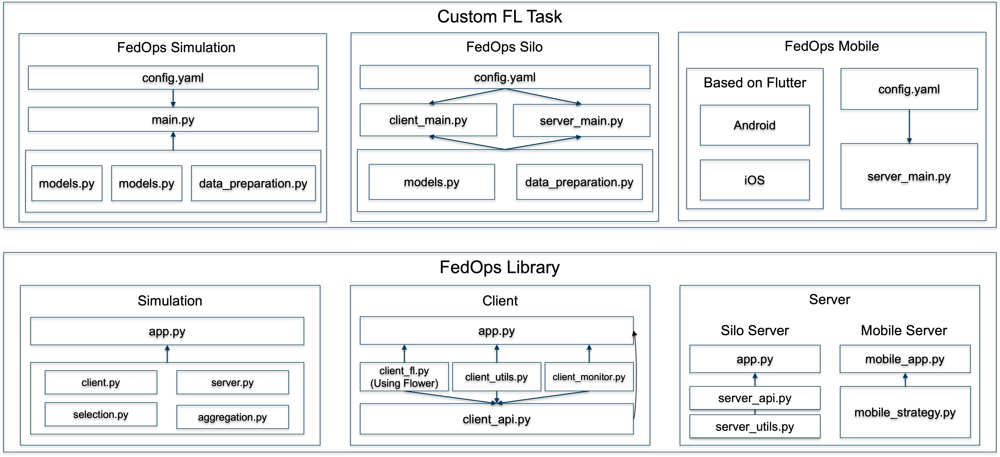

# **FedOps Architecture**

FedOps has five key features:

1. FLScalize: It simplifies the application of data and models in a FL environment by leveraging Flower's Client and Server.

2.  the manager oversees and manages the real-time FL progress of both clients and server
3. Contribution Evaluation and Client Selection processes incentivize individual clients through a BCFL based on their performance.

4. the CI/CD/CFL system integrates with a Code Repo, 
enabling code deployment to multiple clients and servers for continuous or periodic federated learning

5. the FL dashboard is available for monitoring and observing the lifecycle of FL clients and server

# **FedOps Code Architecture**
