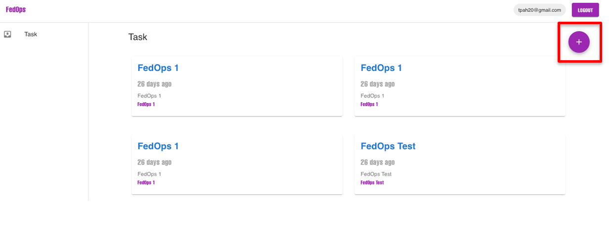
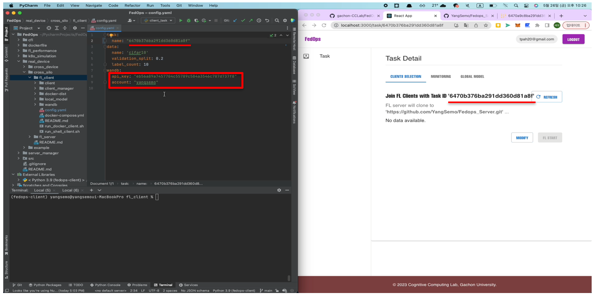
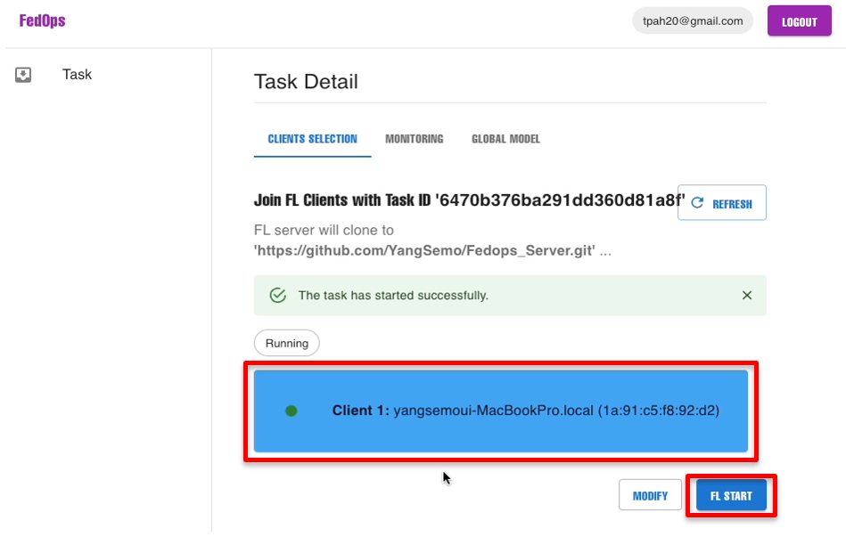
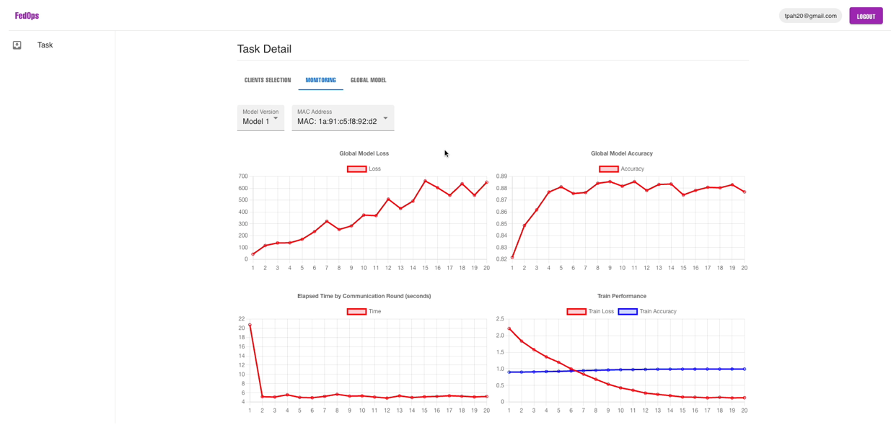
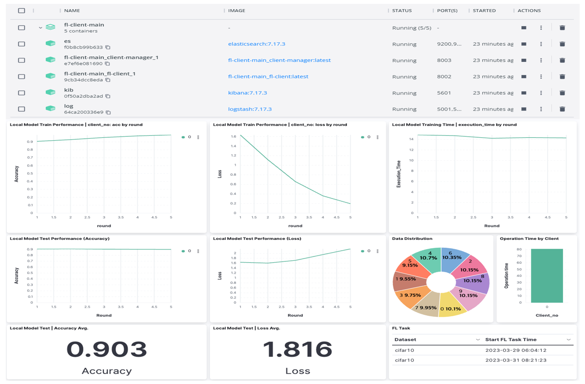

# **FedOps Guide**

-----

We developed a FedOps web service to manage the lifecycle operations of FL on real devices.
Users can create FL tasks and register task ID in the clients.

Once the user select the clients that participate in the FL round, the user can run FL task and that deploys FL server.

As FL is performed, the user monitors local and global model performances and manage/download global model through the web interface.

At the client level, the clients can monitor own data status and performance with WandB or ELK.

## pre preparation - Colne and Install the FedOps
You clone the FedOps git address (https://github.com/gachon-CCLab/FedOps) and install the FedOps Library
```
$ pip install fedops
```
You use the cross-silo project example at https://github.com/gachon-CCLab/FedOps/tree/main/real_device/cross_silo 
and reconfigure custom client and server(fl_client & fl_server) for your FL tasks.

After you finish the local developing/debugging of your FL task project using FedOps library,
you can now deploy it into the FL real-world project.
Finally, create the FL server code(using fl_server) for your FL task in your git repository, then manage the FL server code in that repository.(e.g., successfully run the example  https://github.com/gachon-CCLab/FedOps/tree/main/real_device/cross_silo/fl_server)

## 1. Create and Manage FL Task



To get started, create your FL Task in the FedOps web interface.
Enter the title, description, and tags for your Task. 

Additionally, provide the address of the FL server Git repository that you have created. 
Once registered, it is not cumbersome to upload the code file to the web because you can separately manage the FL server code only in Git. 

This will allow the FL server to be deployed and run in CCL server environment.

## 2. Register FL clients


Once your FL Task is created, it will be assigned a unique task ID. In order to register a client in this FL task, the client’s config file needs to be updated with the assigned task ID and the user's WandB information for client monitoring. And run the client and client manager. In this way, the client is registered in the FL task.

-run the client and client manager
```
# run client
$ sh python client/client_task.py

# run client manager
$ sh python client_manager/client_manager.py
```
-docker
```
# run docker-compose.yaml file
$ docker-compose -f docker-compose.yml up -d --build
```

-shell
```
# run client and client manager to background env
$ sh run_shell_client.sh
```
## 3. Select FL clients and Run FL task


After selecting the client, click the "FL Start" button.This deploy and execute the FL server code that you previously set up in the server repository. The FL server creates FL rounds for task.

## 4. FL lifecycle Monitoring by FedOps Web

FedOps provides lifecycle management for FL tasks. You can monitor the performance of the global/local models and track the client's system resource usage based on the model version. Additionally, you can save and manage the global models according to different versions.

## 5. Client Lifecycle Monitoring


 To monitor the performance of the client's local model and the status of the client's data, you can check the information using the WandB that you set up earlier.


The FedOps also supports a docker-based client environment. 
Clients can monitor their data and performance through the ELK stack.
