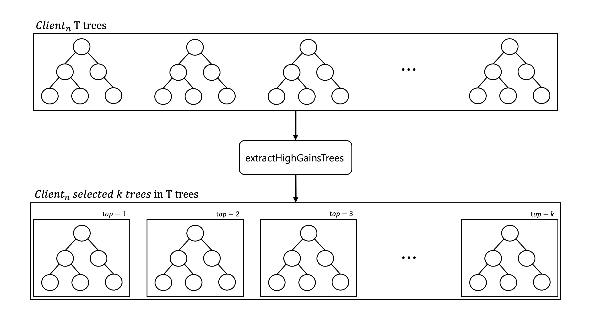
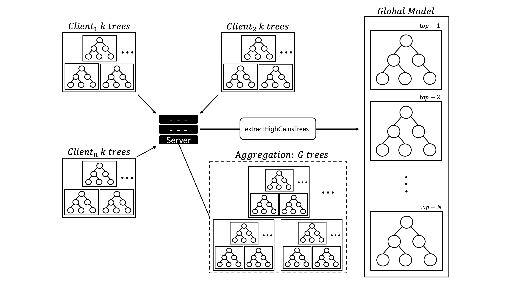
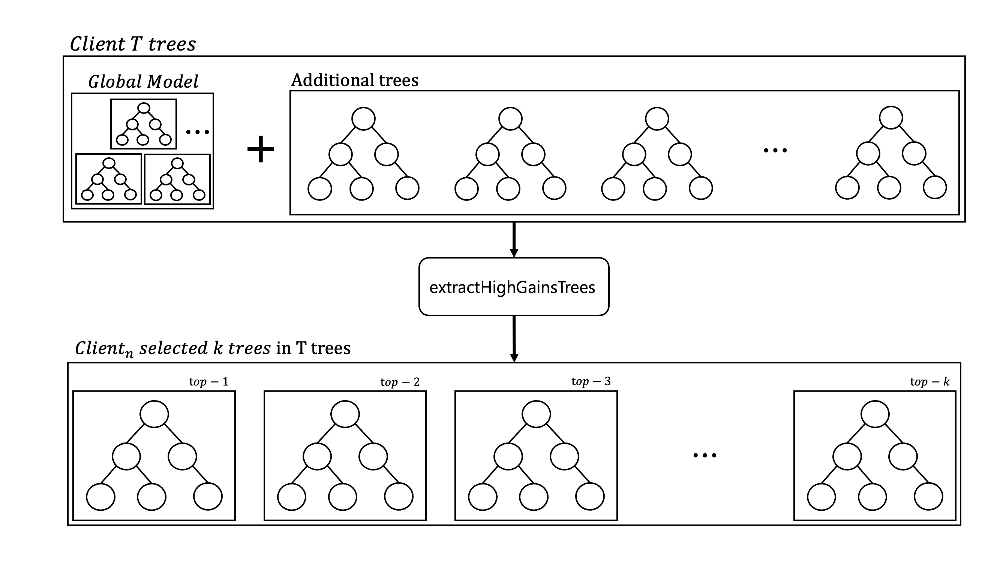

# Federated RandomForest: FedRFBagging

Random forest is one of the powerful ensemble learning techniques widely used in the field of machine learning. This algorithm works by learning multiple decision trees and then combining their prediction results to improve performance. Random forest provides high accuracy and stability, and has the characteristic of preventing overfitting, so it performs effectively on various data sets.

Federated Learning is a way to train machine learning models while maintaining data privacy in a distributed environment. Data is kept local to each client, and only model updates are sent to the central server. This is especially useful in areas that handle sensitive data, such as healthcare or finance.

But, there are difficulties in applying random forests in federated learning.

- Communication overhead: As the number of clients increases, the communication cost increases rapidly during the process of transmitting multiple trees in a random forest.
- Data distribution imbalance: If the data characteristics of each client are different, tree quality imbalance may occur.

### Solution: FedRFBagging

To solve these problems, we have perfected the FedRFBagging algorithm. FedRFBagging provides a structure optimized for federated learning environments while maintaining the bagging characteristics of random forests.

### FedRFBagging Overview

FedRFBagging works like this (see diagram above):

1. Local optimization: Clients train random forests tailored to their own data characteristics and send only high-performing trees to the server.
2. Global integration: The server selects the best trees among the received trees and constructs a global model.
3. Additional learning: The client learns additional trees based on the global model to perform optimizations that reflect local data.

### Summary of Experimental Results

The performance of the FedRFBagging algorithm was evaluated against the centralized (Random Forest) model on various datasets and client environments. The experiments were conducted on binary classification tasks using public datasets such as a9a, cod-rna, ijcnn1, HIGGS, and SUSY, and the main results are as follows.

- Model Performance

  - Global model: Similar or better performance than centralized model on most datasets.
  - Local model: Local models trained on each client achieve higher performance than global and centralized models.
- Communication Cost

  - Communication overhead is greatly reduced by transmitting only the upper performance tree.
  - Communication cost is maintained at a certain level even when the number of clients or the size of the dataset increases, thereby increasing network efficiency.
- Performance according to data distribution

  - Maintains high stability and prediction performance even in environments with imbalanced data.
  - The client's additional learning phase contributes to improved performance by better reflecting local data characteristics.

FedRFBagging has been evaluated as an effective algorithm that can simultaneously maximize communication efficiency and prediction performance of random forest models in a federated learning environment.

For more details, please refer to the [paper](https://www.kci.go.kr/kciportal/landing/article.kci?arti_id=ART003100109).
