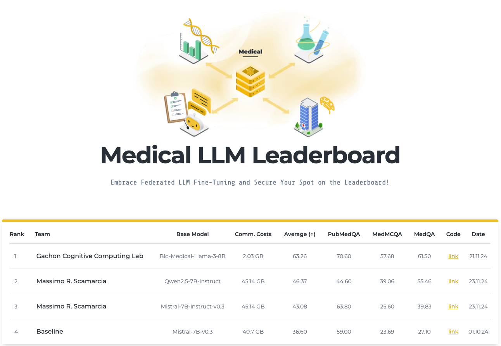

# Flower Medical LLM Leaderboard, New Possibilities Suggested by Gachon Cognitive Computing Labs

Our GCCL team has achieved remarkable results on the [Medical LLM Leaderboard](https://flower.ai/benchmarks/llm-leaderboard/medical/) through our federated learning-based LLM fine-tuning work using FlowerTune. This research is an important step forward to expand the potential of AI medical technology and open new avenues for patient care and medical data utilization.

Flower's Medical LLM Leaderboard is a platform designed to evaluate the performance of language models in the medical field, measuring model accuracy on various medical-related tasks such as PubMedQA, MedMCQA, and MedQA. The platform promotes the development of AI models that understand medical data and clinical practice, and particularly emphasizes the application of Federated Learning-based technologies that enable collaborative learning while protecting sensitive medical data. This helps hospitals and research institutes develop high-performance medical AI models while maintaining the privacy of patient data.

[Our model](https://github.com/gachon-CCLab/GCCL-Medical-LLM-FlowerTune) achieved high performance with an average of **63.26%** on the Flower Medical LLM Leaderboard, with accuracies of **70.60%, 57.68%,** **61.50%** on PubMedQA, MedMCQA, and MedQA tasks, respectively.

Based on the average score, the accuracy was improved by **72.84%** compared to the existing baseline model, and the communication cost was reduced by approximately **20x**.

These achievements were achieved through the following key elements:

1. Utilizing efficient federated learning

   - Based on the FlowerTune platform, we have enabled collaborative learning without sharing sensitive data. This provides a foundation for maximizing model performance while protecting data privacy.
2. Application of PEFT (Parameterized Efficient Fine-Tuning) technique

   - We maximized performance while minimizing model learning costs through efficient fine-tuning techniques. In this process, optimized learning was achieved by reflecting the characteristics of medical data.
3. Design based on Bio-Medical-Llama-3-8B model

   - Based on the Bio-Medical-Llama-3-8B model specialized for processing medical data, it achieved optimal results in various tasks such as PubMedQA, MedMCQA, and MedQA.

In the future, we plan to increase the explainability of our models and develop solutions that can be utilized in global healthcare systems by leveraging multilingual medical datasets.
