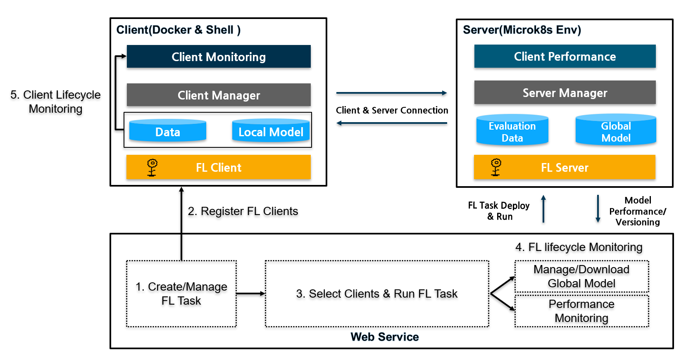
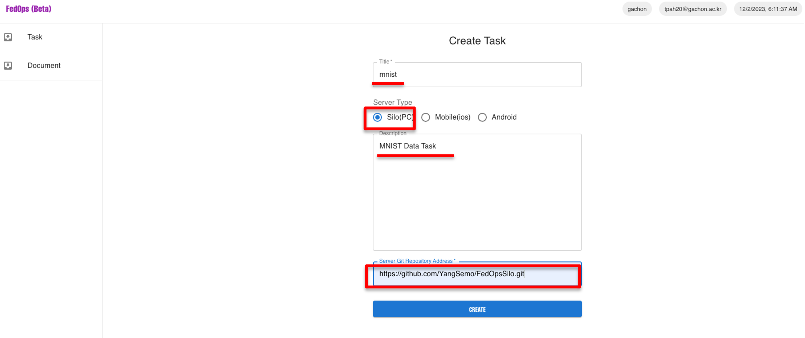
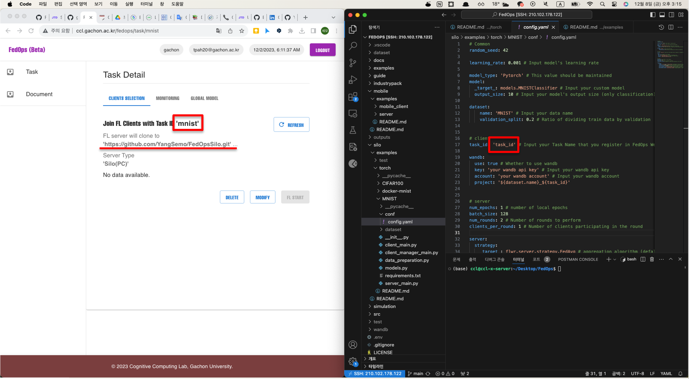
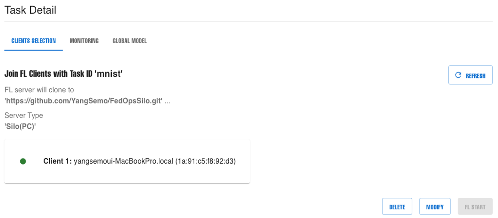
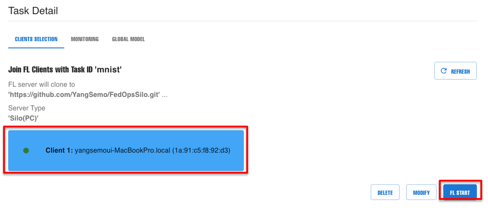
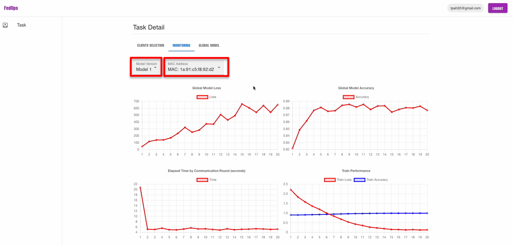
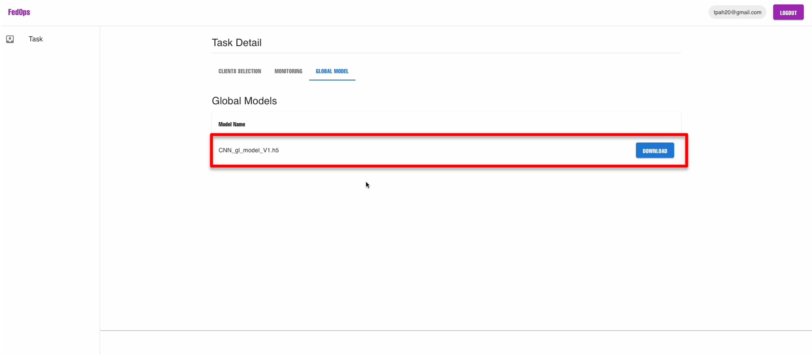

# FedOps Silo User Guide

-----
 <br>
We developed a FedOps web service to manage the lifecycle operations of FL on real devices.
Users can create FL tasks and register task ID in the clients.

Once the user select the Silo clients that participate in the FL round, the user can run FL task and that deploys FL server.

As FL is performed, the user monitors local and global model performances and manage/download global model through the web interface.

At the client level, the clients can monitor own data status and performance with WandB.

## Preparation - Customize the FedOps example code
- You clone the FedOps git address (https://github.com/gachon-CCLab/FedOps)
-  Customize the FedOps silo example code to align with your FL task.
- Refer FedOps silo example code
    ```
    $ git clone https://github.com/gachon-CCLab/FedOps.git && mv FedOps/silo/examples/torch/MNIST . && rm -rf FedOps
    ```
    - Data & Model:
        - Prepare your data in  `data_preparation.py`  and define your model in  `models.py`.
        - Enter your data and model in  `conf/config.yaml`

    - Client:
        - Configure settings in  `conf/config.yaml`  for task ID data, and WandB information.
        - Implement `data_preparation.py` for data handling.
        - Build  `models.py`  for local model specifications.
        - Register data and model, and run the client using  `client_main.py`.

    - Server:
        - Configure settings in  `conf/config.yaml`  for FL aggregation hyperparameters and data information.
        - Implement  `models.py`  to initialize the global model.
        - Register data (for evaluating the global model) and initialize the global model in  `server_main.py`.


## 1. Create and Manage FL Task



- Enter the title, description, and client type for your Task. 

- Additionally, provide the address of the FL server Git repository that you have created.
    - Set up your own Git repository and add the FL server code(`server_main.py, models.py, data_preparation.py, requirementst.txt, conf/config.yaml`).
- Once registered, it is not cumbersome to upload the code file to the web because you can separately manage the FL server code only in Git.

- This will allow the FL server to be deployed and run in CCL server environment.


## 2. Register FL clients


- Once your FL Task is created, it will be assigned a unique task ID. 

- In order to register a client in this FL task, the `conf/config.yaml` file needs to be updated with the assigned Task ID.

- You need to set data, model info, FL hyperparameter and the user's WandB information for client monitoring. 

<br>


- When you run the client and client manager, the client is registered as above.

- Run the client and client manager
    ```bash
    # If you don't have fedops env
    # Install fedops libray in your python env(conda)
    pip install fedops scikit-learn

    # Install torch & torchvision for using pytorch
    pip install torch torchvision
    ```

    ```bash
    # run client
    $ python3 client/client_task.py

    # run client manager
    $ python3 client_manager/client_manager.py
    ```

- Please refer to this link to run both elements: [Run Client](https://github.com/gachon-CCLab/FedOps/tree/main/silo/examples/torch/docker-mnist)


## 3. Select FL clients and Run FL task


- After selecting the client, click the `FL Start` button.
- This deploy and execute the FL server code that you previously set up in the server repository. 
- The FL server creates FL rounds for task.


## 4. FL lifecycle Monitoring by FedOps Web


- FedOps provides lifecycle management for FL tasks. 
- You can monitor the performance of the global/local models and track the client's system resource usage based on the model version. 
- Additionally, it is possible to check separately for each client.

<br>



- You can save and manage the global models according to different versions.


## 5. Client Lifecycle Monitoring


 - To monitor the performance of the client's local model and the status of the client's data, you can check the information using the WandB that you set up earlier.
